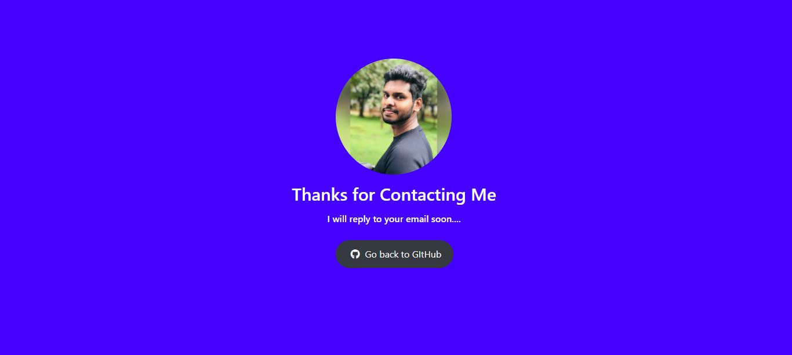

# Contact-Me
Send me a message with using Javascript form. And I will reply to your message.  

 

💻😍 You can use this link to send me a message : https://send-me-a-message.netlify.app/

### Table of Content
-01 [What is this?](#What) 
-02 [For why?](#why) 
-03 [What are the technologies used?](#technologies) 
-04 [How to used this?](#How) 

## What is this?<a name="What"/>
This is a simple contact form without using PHP and mail server. 

## For why?<a name="why"/>
This is a contact form for anyone who looking for contacting me.😉😠

## What are the technologies used?<a name="technologies"/>
- HTML
- CSS
- JavaScript
- Bootstrap
- Google Sheets

## How to use this?<a name="How"/>

Just filling the form fields and click **send message** button.  
  

If the message is successfully sent you will get the **Message Send Successfully** window.  
  

If the message is didn't send you will get the Something going wrong..!!window.  
  

If you sent a message to me I can see your message on Google sheet and I'll reply soon to your email address which you provide me in the form.❤️😍
  

